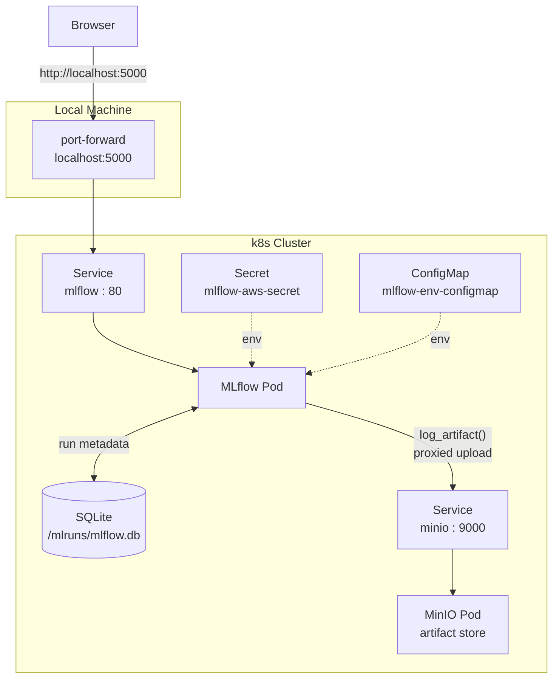

# mlflow-on-k8s

Deploying MLflow on Kubernetes using Helm, with MinIO as the artifact store and SQLite as the backend store.

## Overview

This project demonstrates how to:
- Deploy MLflow and MinIO on a Kubernetes cluster using Helm
- Store run metadata in a persistent SQLite database
- Store artifacts (files, models) in MinIO via MLflow's proxied artifact storage
- Access the MLflow UI from a local machine via `kubectl port-forward`

## Architecture



## Stack

- Kubernetes (k3s via Rancher Desktop)
- Helm
- MLflow
- MinIO (S3-compatible artifact store)
- Python

## Quick Start

### Prerequisites

- Rancher Desktop (or any local k8s cluster)
- Helm
- kubectl

### 1. Deploy MinIO

```bash
helm repo add bitnami https://charts.bitnami.com/bitnami
helm install minio bitnami/minio -f helm/minio/values.yaml
```

### 2. Create the artifact bucket

Port-forward MinIO and create the `mlflow` bucket via the console:

```bash
kubectl port-forward svc/minio 9001:9001 &
# Open http://localhost:9001 (user: minio, password: minio123)
# Create a bucket named "mlflow"
```

### 3. Deploy MLflow

```bash
helm repo add community-charts https://community-charts.github.io/helm-charts
helm install mlflow community-charts/mlflow -f helm/mlflow/values.yaml
```

### 4. Access the MLflow UI

```bash
kubectl port-forward svc/mlflow 5000:80 &
# Open http://localhost:5000
```

### 5. Run the practice script

```bash
export MLFLOW_TRACKING_URI=http://localhost:5000
python tools/mlflow-practice.py
```

## Key Configuration

| Concern | Solution |
|---|---|
| Backend store | SQLite at `/mlruns/mlflow.db` (emptyDir volume) |
| Artifact store | MinIO via S3-compatible API |
| Artifact upload | Proxied through MLflow server (`--serve-artifacts`) |
| Client access | `kubectl port-forward` to MLflow service only |
